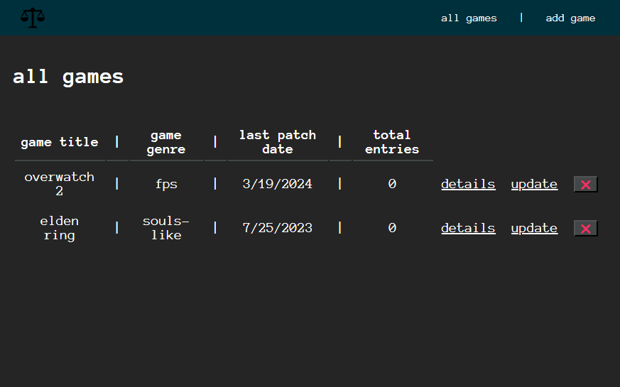
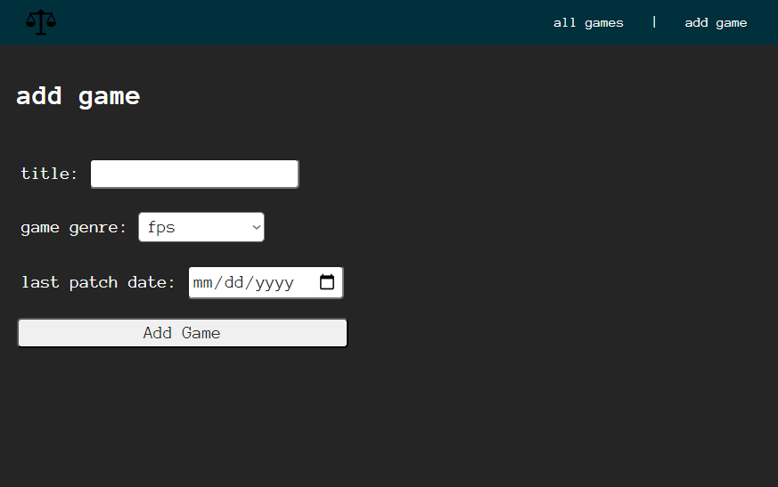
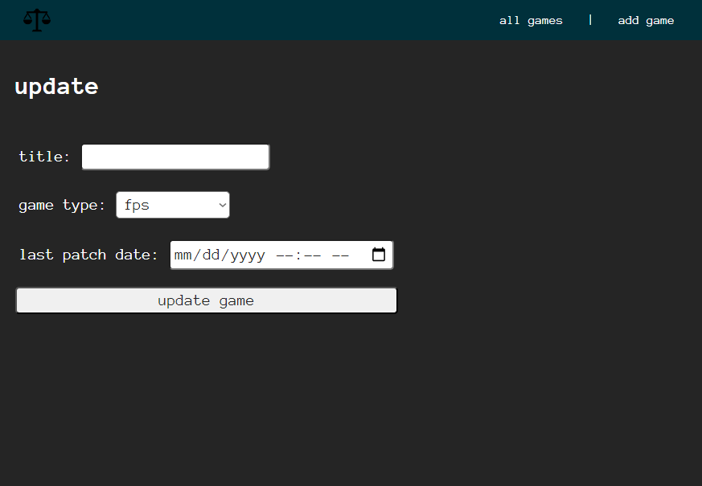
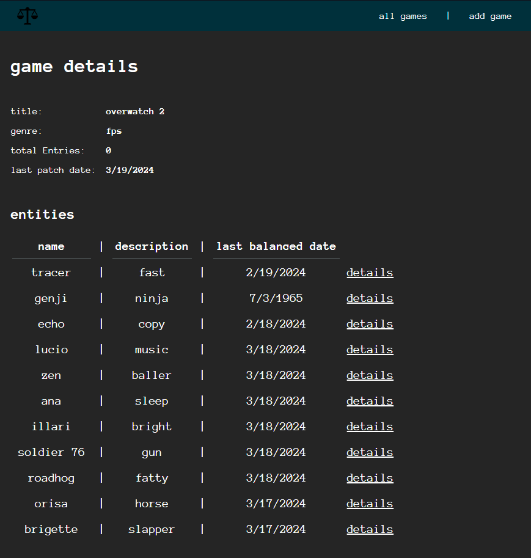

# GAME BALANCE TRACKER
A wiki-type app used to keep track of various balance changes made to the stats of characters or items in video games.

# Screenshots

  
All Games Screen    
  
Add Games Screen    
  
Update Game Info Screen    
  
Game Details Page    

# Technologies Used

- JavaScript
- HTML
- CSS
- Express

# Getting Started

https://github.com/jamesonhussey/game-balance-tracker

# Next Steps

- Details page for entities (use ability schema)
- Entry count for games

 